# 快购阅读-前端

快购阅读是一个基于Vue和Node.js现代前端框架的SPA项目。此为其前端SPA的Web界面。

其后台参见:[https://github.com/WhiteRobe/Qbook_server](https://github.com/WhiteRobe/Qbook_server)

**网站主要功能**
- 商品管理
- 商品检索
- 登录校验
- 管理员后台
- 订单管理
- 购物车
- 预留支付接口
- 账户注册/管理

## 项目初始化 Usage ##

**Step 1. 环境依赖**

windows环境下，运行脚本`初始化环境.bat`，即可自动构建环境依赖(请确保Node.js已在系统下正确配置)

**Step 2. 项目打包**

windows环境下，运行`脚本快速打包.bat`，可以将前端应用包打包至`dist/`目录中。

## 界面预览

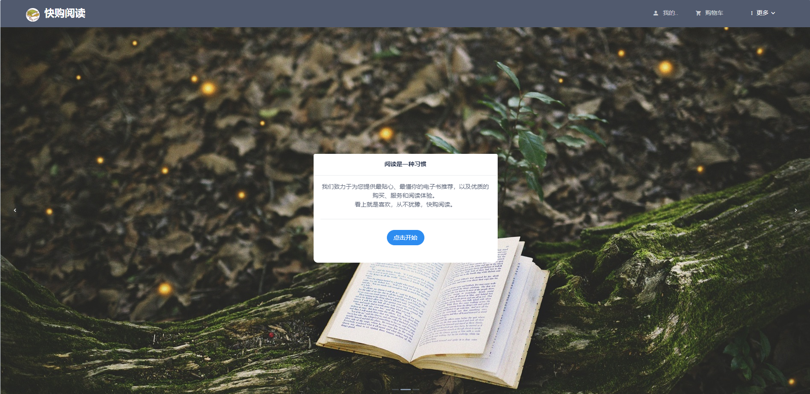

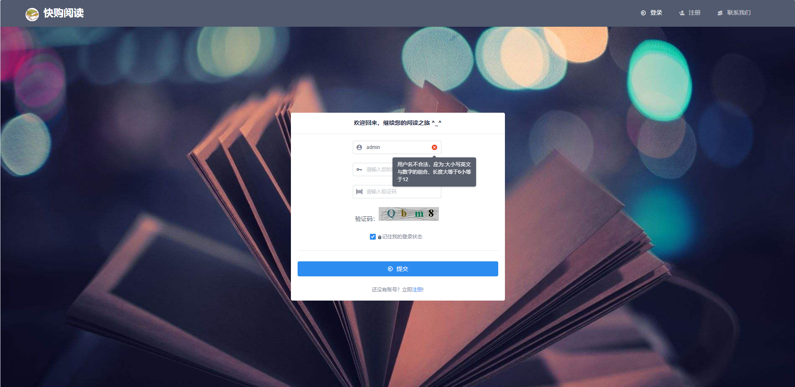

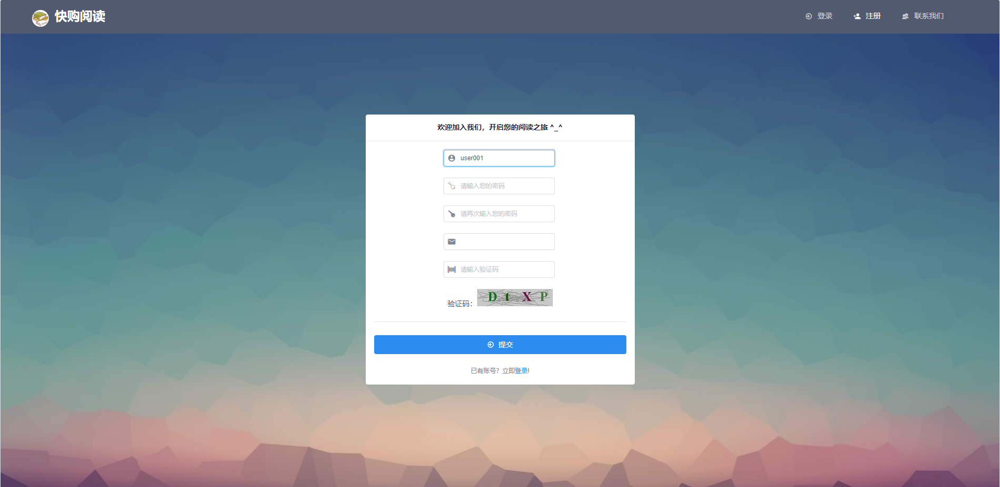

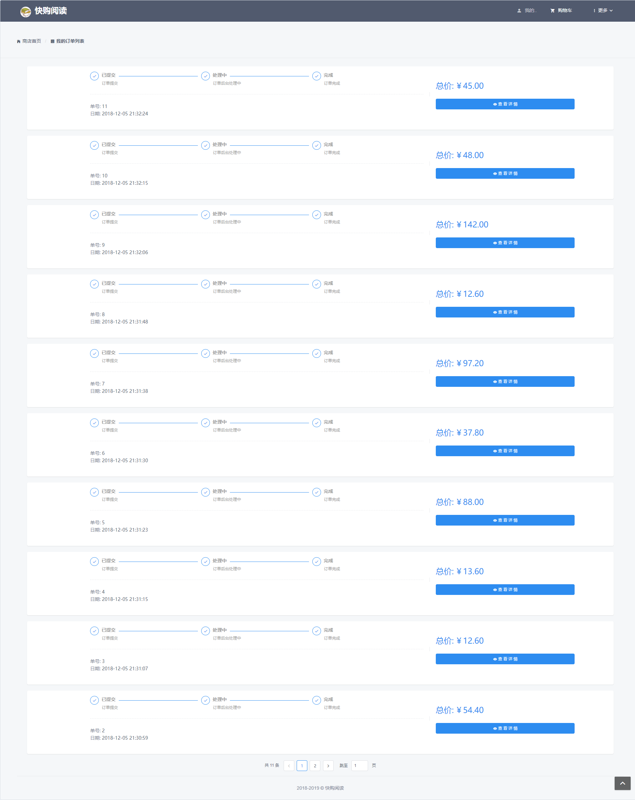

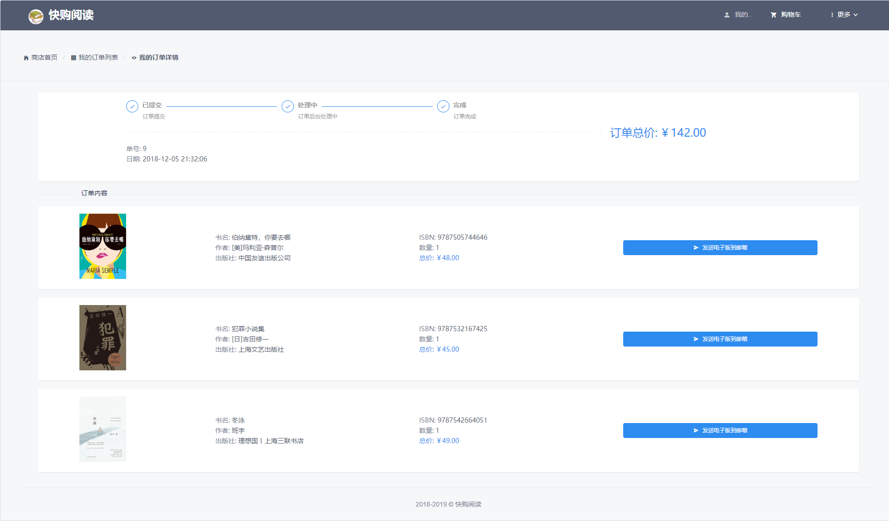

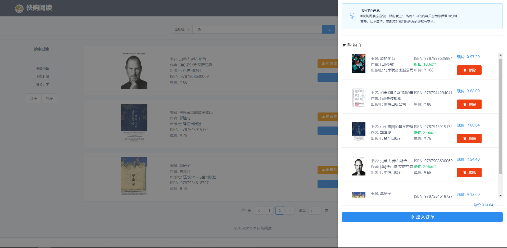

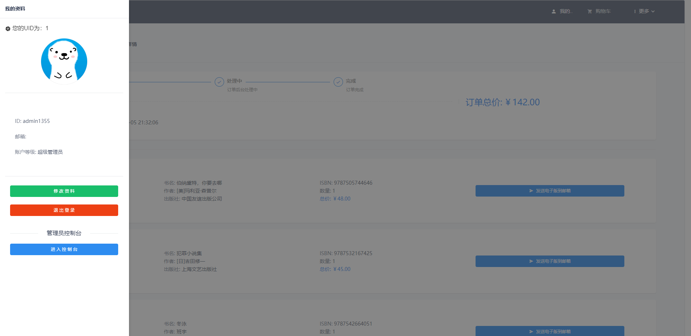

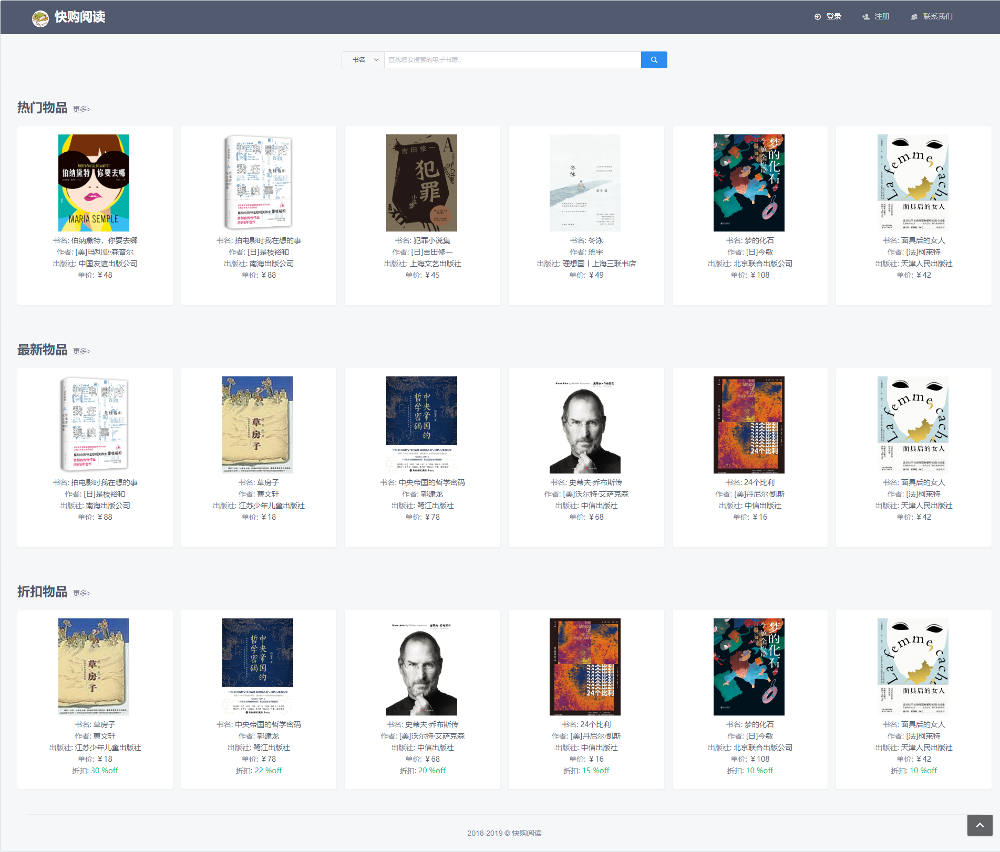

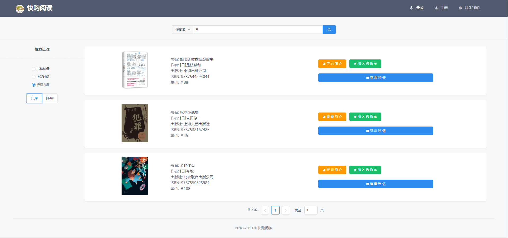

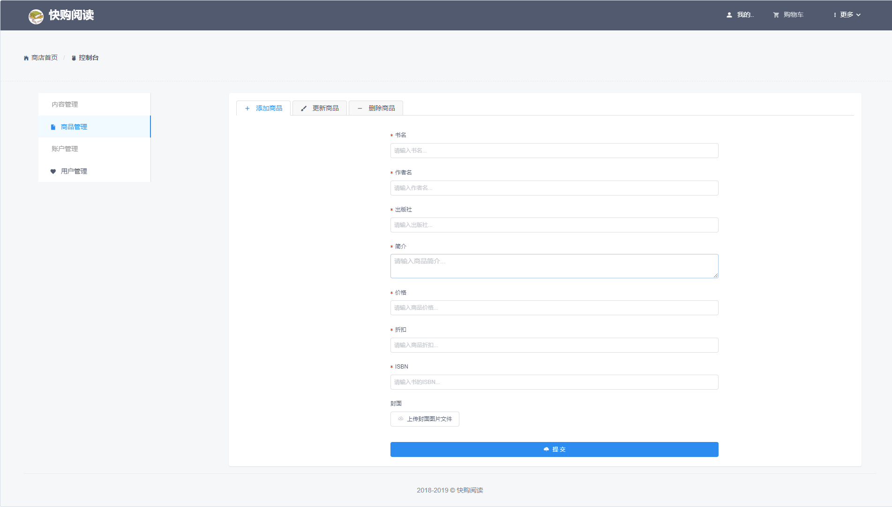

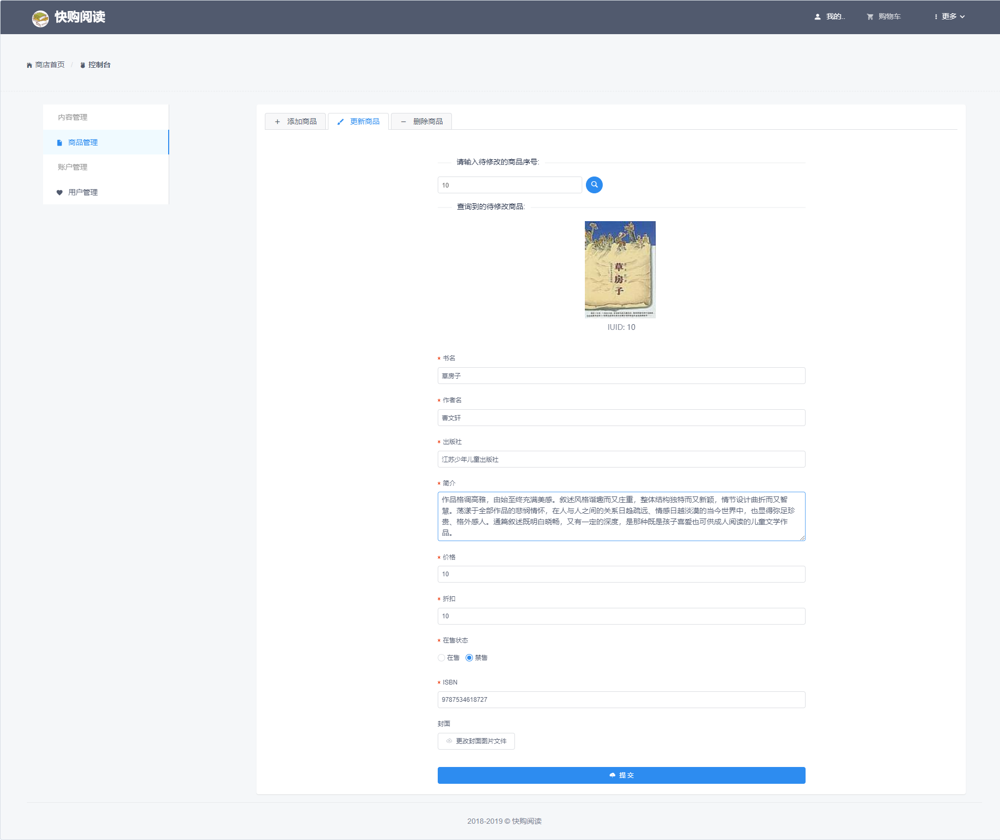

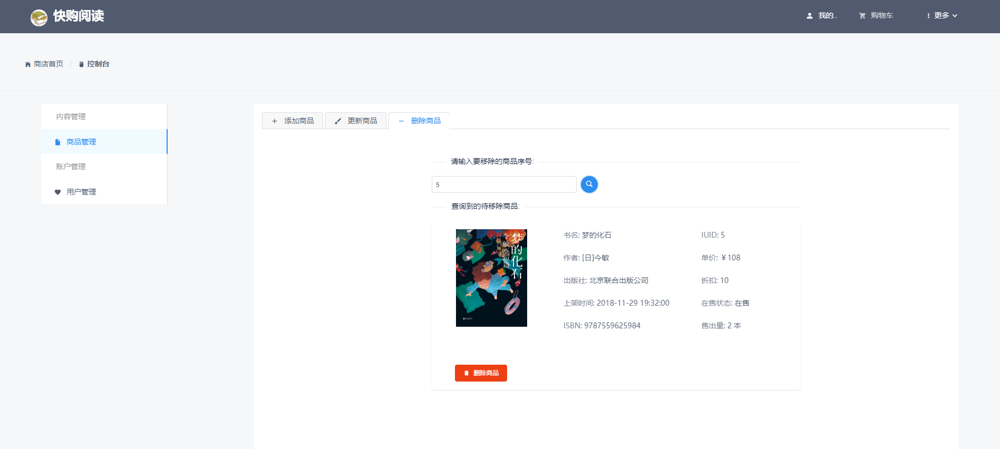

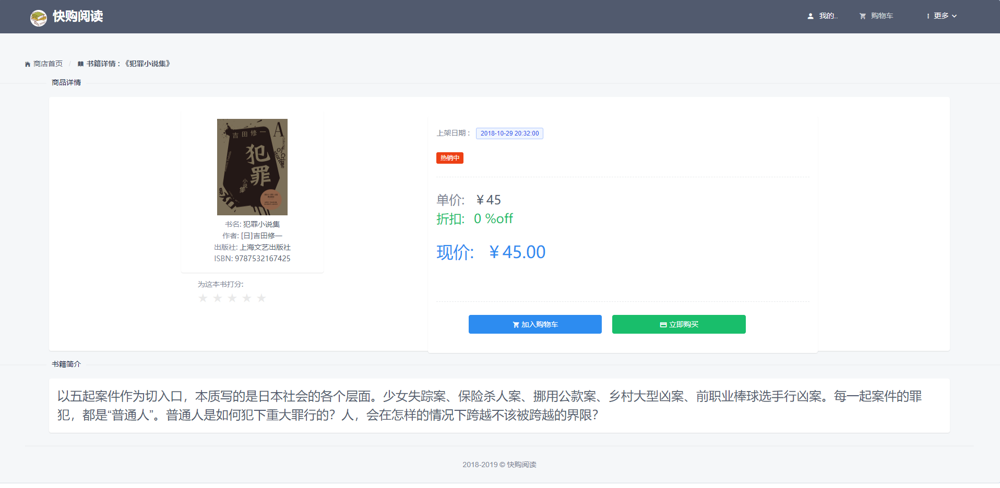
